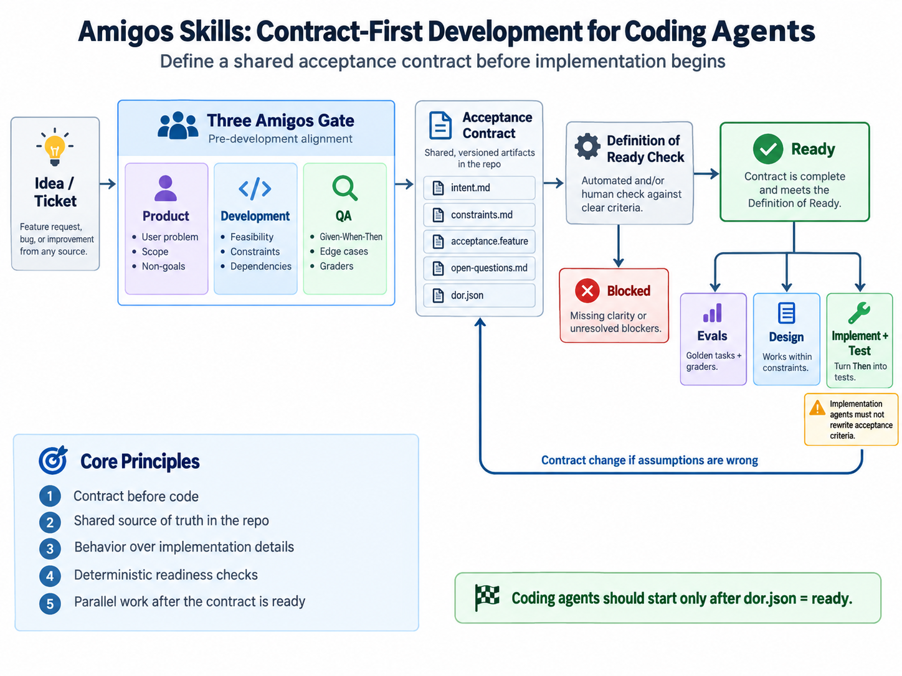

# Amigos Skills

Contract-first development skills for coding agents.



`amigos-skills` turns the **Three Amigos** practice—Product, Development, and QA alignment—into an executable pre-development gate for AI coding agents such as Claude Code and Codex.

The core idea is simple:

> Do not let an implementation agent start coding until the team has a shared, testable contract for what should be built.

The project converts a ticket or feature request into a repository-local contract containing intent, constraints, acceptance scenarios, open questions, and a deterministic Definition of Ready.

Once the contract becomes `ready`, evaluation, design, implementation, and testing can proceed from the same source of truth.

---

## 0. Status

The deterministic core is implemented and this repository is held to it.

```bash
python -m pytest -q          # the test suite
amigos status                # every story in this repository, and its state
amigos check STORY-002       # one story's Definition of Ready
amigos gate --staged         # may this commit touch what it touches?
```

Contracts are generated rather than hand-authored from v0.3 on:

```text
/amigos STORY-123 "a description of what should change"
```

| Layer | State |
|---|---|
| Contract protocol under `.amigos/` | Built |
| Deterministic validator and acceptance lint | Built |
| Repository gate | Built |
| `/amigos` | Built |
| Product, Development and QA subagents | Built |
| `/implement` | Not built |

Sections 1 to 37 below are the specification of intent; they describe the whole
system, most of which is still ahead. [docs/roadmaps.md](docs/roadmaps.md)
tracks what exists today, and [docs/](docs/README.md) records how it is built.

Requires Python 3.11 or newer. The runtime has no third-party dependencies.

---

## 1. Why This Project Exists

AI coding agents are increasingly capable of planning, implementing, testing, and reviewing software.

The harder problem is no longer only:

> Can the agent write the code?

It is:

> Does the agent know exactly what should be built, what should not be built, and how success will be judged?

Without an explicit contract, different agents can independently reinterpret the same request:

- Product reasoning invents additional requirements.
- Design silently changes expected behavior.
- Implementation expands scope.
- Tests validate the implementation rather than the original intent.
- Review agents criticize code using standards that were never agreed upon.
- Evals encode ambiguous or accidental behavior.

`amigos-skills` establishes a hard boundary before implementation.

```text
Idea / Ticket
      |
      v
+---------------------+
|    Three Amigos     |
|---------------------|
| Product             |
| Development         |
| QA                  |
+---------------------+
      |
      v
Acceptance Contract
      |
      +------------------+------------------+
      |                  |                  |
      v                  v                  v
    Evals              Design          Code + Test
```

The contract, not chat history, becomes the authoritative specification.

---

## 2. What Three Amigos Means Here

Three Amigos is a pre-development alignment practice involving three independent perspectives.

### Product

Product defines:

- who has the problem;
- what problem should be solved;
- why it matters;
- what successful user behavior looks like;
- what is explicitly out of scope.

Product owns the question:

> Are we solving the right problem at the right scope?

### Development

Development examines:

- technical feasibility;
- system constraints;
- dependencies;
- invariants;
- architectural implications;
- whether the story needs decomposition.

Development owns the question:

> Can this behavior be implemented safely within the existing system?

### QA

QA defines:

- observable acceptance criteria;
- edge cases;
- counterexamples;
- failure conditions;
- appropriate grader types.

QA owns the question:

> Can two independent reviewers determine the same pass/fail result?

No single role owns the complete decision.

The goal is not consensus for its own sake. The goal is a sufficiently precise contract that downstream agents cannot freely reinterpret the requirement.

---

## 3. Core Principle: Contract Before Implementation

Every story moves through the following lifecycle:

```text
draft
  |
  v
amigos_running
  |
  +-----------> blocked
  |
  v
ready
  |
  +-----------> evals
  |
  +-----------> design
  |
  +-----------> implementation + tests
```

Once a story reaches `ready`, its acceptance contract is treated as immutable by implementation agents.

If the contract is discovered to be incorrect:

```text
ready
  |
  v
contract_change
  |
  v
amigos_running
```

The implementation agent must never silently rewrite acceptance criteria to make its implementation pass.

---

## 4. Repository Contract

Each story receives a repository-local contract.

```text
.amigos/
├── config.json
└── stories/
    └── STORY-123/
        ├── intent.md            input
        ├── constraints.md       input
        ├── acceptance.feature   input
        ├── open-questions.md    input
        ├── state.json           input, agent-owned lifecycle
        └── dor.json             output, validator-owned
```

These files are the authoritative interface between Three Amigos and every downstream agent.

Chat history is not authoritative.

---

## 5. Contract Artifacts

### `intent.md`

Defines the business intent.

Recommended structure:

```markdown
# Intent

## User
Who experiences the problem?

## Problem
What problem are we solving?

## Desired Outcome
What observable result should change?

## Why Now
Why is this worth implementing?

## In Scope
- ...

## Out of Scope
- ...

## Success
What would make the user consider this successful?
```

### `constraints.md`

Defines implementation boundaries without prescribing unnecessary implementation details.

Examples:

```markdown
# Constraints

## Technical Constraints
- Existing public API behavior must remain backward compatible.
- Authentication must continue to use the current identity provider.

## Dependencies
- Billing service
- User profile API

## Invariants
- Existing accounts must not be modified.
- Failed requests must remain idempotent.

## Relevant Components
- src/billing/
- src/users/
```

Constraints should describe boundaries and invariants.

They should not prematurely freeze incidental implementation paths.

### `acceptance.feature`

Contains executable-style behavioral acceptance criteria using Given-When-Then.

Every scenario carries exactly one of `@primary` or `@counterexample`. That tag
is what makes "at least two counterexamples" decidable by a script rather than
inferred from wording.

```gherkin
Feature: Update billing email

  @primary
  Scenario: User updates a valid billing email
    Given an authenticated user with an active account
    When the user changes the billing email to a valid new address
    Then the billing email is updated
    And the account identifier remains unchanged

  @counterexample
  Scenario: User submits an invalid email
    Given an authenticated user with an active account
    When the user submits an invalid email address
    Then the billing email is not changed
    And a validation error is returned

  @counterexample
  Scenario: User attempts to update another account
    Given an authenticated user
    When the user attempts to modify a different user's billing email
    Then the request is rejected
    And no billing information is changed
```

A ready story should normally contain:

- at least one primary path;
- at least two meaningful counterexamples or failure scenarios.

### `open-questions.md`

Tracks unresolved questions explicitly.

```markdown
# Open Questions

## Blocking

None.

## Non-blocking

- Should validation errors reuse the existing API error code?
```

Blocking questions prevent the story from becoming ready.

### `state.json`

Agent-owned lifecycle record.

```json
{
  "schema_version": 1,
  "story_id": "STORY-123",
  "declared_state": "amigos_running",
  "updated_at": "2026-09-13T00:00:00Z",
  "history": [
    { "state": "draft", "at": "2026-09-12T09:00:00Z", "note": "story workspace created" }
  ]
}
```

`declared_state` accepts `draft`, `amigos_running` and `contract_change`. It does
not accept `ready` or `blocked`. Those are computed, and declaring one is a
structural error rather than a warning.

A declared state can only ever *withhold* readiness, never grant it:
`amigos_running` and `contract_change` both mean "not ready regardless of the
checks".

### `dor.json`

Machine-readable Definition of Ready. Derived, never hand-edited, and written by
the validator alone.

```json
{
  "schema_version": 1,
  "story_id": "STORY-123",
  "state": "ready",
  "ready": true,
  "declared_state": "draft",
  "generated_at": "2026-09-13T00:00:00Z",
  "generator": "amigos 0.1.0",
  "checks": {
    "intent_defined": true,
    "scope_defined": true,
    "constraints_defined": true,
    "primary_scenario_present": true,
    "counterexamples_present": true,
    "assertions_are_determinable": true,
    "blocking_questions_resolved": true
  },
  "failures": [],
  "blocking_questions": [],
  "scenarios": { "primary": 1, "counterexample": 2, "total": 3 },
  "contract_hash": { "acceptance.feature": "sha256:..." }
}
```

`dor.json` is generated by deterministic rules.

The model that generated the contract is not the judge of whether the contract
is ready. Splitting the agent-owned `state.json` from the validator-owned
`dor.json` is what makes that structural rather than a matter of discipline.

`contract_hash` records the content of each input file at the moment of
judgement. It is the baseline that contract-immutability enforcement diffs
against.

---

## 6. Given-When-Then as the Contract Language

Given-When-Then separates:

```text
Given  -> relevant starting state
When   -> action or event
Then   -> externally judgeable outcome
```

AI agents are useful for generating candidate scenarios, but generated scenarios are not automatically authoritative.

Bad:

```gherkin
Then the request is handled correctly
```

Good:

```gherkin
Then the API returns HTTP 403
And no account data is modified
```

The important property is independent judgeability.

---

## 7. GWT Selection Rules

Not every generated scenario should enter the contract.

A candidate scenario should pass these filters:

1. **Risk coverage** — removing it would lose detection of a meaningful failure class.
2. **Determinability** — the `Then` has a clear pass/fail interpretation.
3. **Intent over implementation** — behavior is constrained, not accidental execution paths.
4. **Non-duplication** — it covers a distinct risk dimension.
5. **Counterexample test** — a plausible nearby failure can be described.
6. **Maintenance cost** — its long-term signal justifies its execution cost.

Scenarios derived from real incidents, complaints, traces, and regressions should receive priority.

---

## 8. Skills Architecture

The initial project contains two primary user-facing skills:

```text
/amigos
/implement
```

Three specialized subagents support `/amigos`:

```text
product
dev
qa
```

Architecture:

```text
                    /amigos
                       |
          +------------+------------+
          |            |            |
          v            v            v
       Product        Dev           QA
       Agent          Agent        Agent
      (blind)       (blind)      (blind)
          |            |            |
          +------------+------------+
                       |
                amigos findings
                       |
                 Reconciliation
                       |
                       v
                Contract Files
                       |
                  check_dor.py
                       |
              +--------+--------+
              |                 |
           blocked             ready
                                  |
                                  v
                             /implement
```

---

## 9. Skill: `/amigos`

`/amigos` creates or updates the acceptance contract for a story.

```text
/amigos STORY-123 "a description of what should change"
```

Phases:

```text
0  Set up      create or reopen; declare amigos_running; write the ticket
1  Draft       three agents, same ticket, none sees another's output
2  Count       amigos findings; what did exactly one role notice?
3  Reconcile   merge the drafts; every conflict resolves into the contract
4  Interview   at most two rounds, only on what would become an assumption
5  Synthesise  write the four input files
6  Validate    amigos check, repair, re-check, at most three attempts
7  Finish      return to draft; report ready or blocked, with the count
```

`amigos_running` withholds readiness for the whole run, so a half-written
contract can never read as ready to anything downstream.

The three roles draft **blind**: each is a separate agent with no inherited
context, all three prompts are assembled before any of them runs, and none
receives another's output. Independence stated in an instruction is not
independence; an agent told to ignore what it has read has still read it.

Phase 2 is the only place the split is measured, and it is measured by code.
Two findings are the same finding when they name the same target section and the
same risk dimension. A run reports how many findings exactly one role named — a
count of zero is a reportable result, not a failure, and it is the signal that
the split is not earning its cost.

A missing, malformed or empty findings record stops the run. Two roles plus a
gap is not the Three Amigos, and a contract reconciled from the remaining two
would carry the appearance of three perspectives without the substance.

Both loops are bounded. The interview stops at two rounds and whatever remains
becomes a blocking question; an agent required to reach zero blockers has an
incentive to accept a weak answer. The repair loop stops at three attempts and
reports what is left; an unbounded loop against a rule the model has not
understood ends in the same place having spent more.

The skill may never write `dor.json`, declare `ready` or `blocked`, carry one
role's work into another role's prompt, invent an assumption to clear a blocker,
or write a transcript into the story.

The output is not the conversation.

The output is the contract.

---

## 10. Subagent: Product

The Product subagent protects user intent and scope.

### Inputs

- the ticket, verbatim;
- PRD;
- product documentation;
- business context;
- priority information;
- previous contracts where relevant.

No other role's output. Product drafts blind.

### Responsibilities

It determines:

- target user;
- user problem;
- desired outcome;
- business motivation;
- in-scope behavior;
- out-of-scope behavior;
- ambiguous assumptions.

It drafts `intent.md` and returns a findings record.

### Must Not

Product must not:

- generate code patches;
- choose implementation architecture;
- invent unsupported requirements;
- expand scope because adjacent functionality seems useful;
- write into the story directory, or ask the user a question.

---

## 11. Subagent: Development

The Development subagent protects feasibility and system integrity.

### Inputs

- the ticket, verbatim;
- repository structure;
- existing implementation;
- architecture decisions;
- APIs;
- schemas;
- tests;
- dependencies.

No other role's output. Development reads the request and the code, not a
Product draft to react to.

### Responsibilities

It identifies:

- feasibility;
- system boundaries;
- dependencies;
- invariants;
- compatibility constraints;
- technical ambiguity;
- decomposition requirements.

It drafts `constraints.md` and returns a findings record.

### Must Not

Development must not:

- expand product scope;
- redefine success for implementation convenience;
- silently reject requirements;
- turn incidental implementation order into contract requirements;
- write code, write into the story directory, or ask the user a question.

---

## 12. Subagent: QA

The QA subagent converts intent into falsifiable behavior.

### Inputs

- the ticket, verbatim;
- incidents;
- tests;
- bug reports;
- traces;
- known failure modes.

No other role's output. QA decides what would have to be observable for anyone
to say this worked, rather than making someone else's intent testable.

### Responsibilities

It generates:

- main-path scenarios;
- counterexamples;
- edge cases;
- failure scenarios;
- grader recommendations;
- ambiguity findings.

It drafts `acceptance.feature` and returns a findings record.

Typical grader types include:

```text
unit test
integration test
schema validation
snapshot comparison
file diff
database assertion
exit code
HTTP assertion
rule-based grader
model-based grader
human review
```

Deterministic graders should be preferred whenever possible.

### Must Not

QA must not:

- write empty assertions;
- freeze incidental implementation details;
- invent unsupported requirements;
- mark ambiguous behavior as ready;
- run or write tests, write into the story directory, or ask the user a question.

---

## 13. Independence, Then Reconciliation

Agents reason independently before convergence. Not "whenever practical" —
always, because the alternative is cheap to produce and impossible to tell apart
from the real thing.

```text
one ticket, three agents, no shared context
        ↓
Product drafts intent      Development drafts constraints      QA drafts scenarios
        ↓                            ↓                               ↓
        +----------------------------+-------------------------------+
                                     ↓
                     the overlap is counted, by code
                                     ↓
                 reconciliation: conflicts resolve into the contract
                                     ↓
                             Contract synthesis
```

The goal is structured disagreement, not unrestricted debate. Sequential
challenge — Product proposes, Development challenges, QA challenges both — reads
as disagreement but is not: each role has already absorbed the previous one's
framing, and a role that inherits a framing can only argue at its edges.

Reconciliation is where conflicts resolve, and every one of them resolves into
the contract: a narrowed scope, an added counterexample, a new invariant, or a
blocking question. Never into a commentary section, and never by preferring the
role that wrote more fluently.

A finding nobody acts on is still a decision. It stays in the run record with
the role that made it, so a contract that quietly ignored a perspective is
visible afterwards rather than indistinguishable from one that had nothing to
ignore.

### The findings record

Each role returns one, structured rather than prose:

```json
{
  "role": "dev",
  "target_file": "constraints.md",
  "target_section": "Dependencies",
  "risk_dimension": "dependency",
  "statement": "The request assumes a token service this repository does not contain."
}
```

Structure is what makes the question answerable. Three roles producing three
pages of prose can be summarised as agreeing or disagreeing to taste; three sets
of `(target section, risk dimension)` pairs can be intersected.

```bash
amigos findings STORY-123 --product p.json --dev d.json --qa q.json
```

Two findings are the same finding when they name the same target section and the
same risk dimension. The command reports how many findings exactly one role
named. A run where that count is zero has to say so:

```text
No role contributed a finding the others missed.
```

That sentence is the kill criterion firing. The design is not defended by
argument; it is kept because the number says it earns its cost, and dropped when
the number says it does not.

---

## 14. Skill: `/implement`

`/implement` may operate only on ready stories.

```text
/implement STORY-123
```

Before changing business code:

```text
.amigos/stories/STORY-123/dor.json
```

must contain:

```json
{
  "ready": true
}
```

Responsibilities:

1. Load the contract.
2. Translate relevant `Then` clauses into tests.
3. Establish a baseline where useful.
4. Implement the minimum required behavior.
5. Run tests and evals.
6. Check for scope expansion.
7. Report discrepancies.

The implementation skill must not modify acceptance criteria.

If implementation discovers a contract problem:

```text
/implement
    ↓
contract conflict
    ↓
contract_change
    ↓
/amigos
```

---

## 15. Evals Integration

Acceptance criteria and evals should share the same behavioral source.

```text
Intent
  ↓
Acceptance Criteria
  ↓
Golden Tasks
  ↓
Graders
  ↓
Implementation
```

Avoid the reverse:

```text
Implementation
  ↓
Observed behavior
  ↓
Retrofitted eval
```

Product protects user value.

Development identifies observability.

QA identifies meaningful failure dimensions.

---

## 16. Deterministic Definition of Ready

Readiness must be verified by code rather than model confidence.

```bash
amigos check STORY-123
python scripts/check_dor.py STORY-123   # the same thing
```

Checks:

```text
[PASS] intent_defined
[PASS] scope_defined
[PASS] constraints_defined
[PASS] primary_scenario_present
[PASS] counterexamples_present
[PASS] assertions_are_determinable
[PASS] blocking_questions_resolved
```

Exit codes:

```text
0  ready
1  evaluated, not ready
2  structurally unusable, or a usage error
```

The separation between 1 and 2 matters to the repository gate: code 1 is a
contract that needs more work, code 2 is a contract the validator could not read
at all. A structurally unusable story produces no `dor.json`, because recording
a readiness judgement about an unreadable input would be worse than recording
nothing.

---

## 17. Forbidden Acceptance Language

The validator should initially flag vague phrases such as:

```text
correct
correctly
appropriate
appropriately
reasonable
good
proper
properly
user-friendly
works
handled well
expected behavior
```

This should be a lint rule rather than model judgment.

---

## 18. Enforcement

The system must not depend on an agent voluntarily remembering the process.

The rule:

```text
No governed file may be changed unless a story is resolvable and that story's
contract satisfies every Definition of Ready check.
```

One decision, several adapters:

```bash
amigos gate --staged                          # the decision
amigos hooks install                          # git pre-commit adapter
                                              # Claude Code adapter: see section 19
```

### Which files are governed

Governed by default. A path is exempt only if it matches a configured pattern:

```json
"gate": { "exempt": [".amigos/**", "docs/**", "*.md", "LICENSE", ".gitignore"] }
```

The exempt set is exactly the work that makes a story ready. Gating the contract
files would deadlock the protocol, since a story can only become ready by
editing a story. Everything else is governed, including directories that do not
exist yet — an allowlist leaves each new directory unguarded until somebody
remembers it, so the gate erodes silently.

### Which story

Resolved in order: the `AMIGOS_STORY` environment variable, then the
`.amigos/ACTIVE` pointer file, then a story id appearing in the branch name.
Matching is bounded to whole story IDs, and a branch naming two stories refuses
rather than choosing between them.

### What the gate reads

Readiness is recomputed from the contract files on every call. A committed
`dor.json` is a record, never an authority: it may be stale, and it is writable
by the agent being gated.

### What it cannot do

An agent that can edit the hook configuration can disable the in-session hook,
and `git commit --no-verify` skips the pre-commit hook. Both are true of every
such hook. CI enforcement closes them later.

The desired property at this stage is the one stated, not more:

> Skipping the contract should be harder than following it.

---

## 19. Claude Code Integration

```text
CLAUDE.md

.claude/
└── settings.json          PreToolUse hook wiring the gate

.claude-plugin/
└── plugin.json

skills/
├── amigos/SKILL.md
└── implement/SKILL.md

agents/
├── product.md
├── dev.md
└── qa.md

integrations/claude-code/
└── gate_hook.py           the adapter the hook runs
```

`.claude/skills/` and `.claude/agents/` hold symlinks into `skills/` and
`agents/`, so this checkout discovers exactly the files the plugin ships rather
than a second copy that drifts.

The hook wiring:

```json
{
  "hooks": {
    "PreToolUse": [
      {
        "matcher": "Edit|Write|NotebookEdit",
        "hooks": [
          {
            "type": "command",
            "command": "python3 \"$CLAUDE_PROJECT_DIR/integrations/claude-code/gate_hook.py\""
          }
        ]
      }
    ]
  }
}
```

Persistent repository rule:

```text
Before modifying a governed file, the gate verifies the active story's contract.

If it is not ready, run the amigos skill first.

Implementation agents must not modify acceptance.feature directly.
```

---

## 20. Codex Integration

```text
AGENTS.md

.agents/
└── skills/
    ├── amigos/
    │   └── SKILL.md
    └── implement/
        └── SKILL.md

.codex/
└── agents/
    ├── product.md
    ├── dev.md
    └── qa.md
```

The repository contract under `.amigos/` remains platform-independent.

Claude Code and Codex are execution environments.

`.amigos/` is the protocol.

---

## 21. Project Structure

```text
amigos-skills/
├── README.md
├── LICENSE
├── pyproject.toml
│
├── .claude-plugin/
│   └── plugin.json
│
├── .amigos/
│   ├── config.json
│   ├── stories/
│   └── runs/                what each role found, per /amigos run
│
├── src/amigos/
│   ├── config.py            repository configuration
│   ├── gherkin.py           the supported Gherkin subset, with line numbers
│   ├── markdown.py          sections, list items, placeholder detection
│   ├── lint.py              acceptance criteria rules
│   ├── dor.py               the seven checks and dor.json generation
│   ├── story.py             story paths, scaffolding, state.json
│   ├── gate.py              the repository gate decision
│   ├── findings.py          role findings records and the overlap count
│   ├── hooks.py             git pre-commit installation
│   ├── jsonschema.py        in-tree schema checking, no dependency
│   └── cli.py               the command line surface
│
├── skills/amigos/           the orchestrating skill
├── agents/                  product.md, dev.md, qa.md
│
├── scripts/
│   ├── check_dor.py
│   ├── create_story.py
│   ├── findings.py
│   ├── gate.py
│   └── lint_acceptance.py
│
├── integrations/
│   ├── claude-code/         PreToolUse adapter
│   └── git/                 the generated pre-commit hook
│
├── schemas/
│   ├── dor.schema.json
│   ├── findings.schema.json
│   ├── run-summary.schema.json
│   └── state.schema.json
│
├── templates/
│   ├── intent.md
│   ├── constraints.md
│   ├── acceptance.feature
│   ├── open-questions.md
│   └── state.json
│
├── tests/
│   └── fixtures/stories/    stories that each break exactly one rule
│
└── docs/
```

A Codex mirror follows once the core loop works.

`.amigos/stories/` is the specification; `.amigos/runs/` is evidence about how a
contract was produced. Nothing downstream reads the run records, which is why
they live one directory away from the contract a downstream agent does read.

The project's own `.amigos/` directory is intentionally part of the repository.

It is not merely example data.

It records how `amigos-skills` itself is developed.

---

## 22. CLI Surface

```bash
amigos init                 # create .amigos/ in this repository
amigos create STORY-123     # scaffold a story contract workspace
amigos check STORY-123      # evaluate the Definition of Ready, write dor.json
amigos lint STORY-123       # report unjudgeable acceptance criteria
amigos status               # summarise every story
amigos gate --staged        # may this change touch what it touches?
amigos state STORY-123 --set amigos_running    # record a lifecycle transition
amigos findings STORY-123 --product p.json --dev d.json --qa q.json
amigos hooks install        # install the git pre-commit adapter
```

Useful flags:

```text
--json           machine-readable output, for hooks and CI
--no-write       evaluate without writing dor.json
--stories-dir    point at a story corpus outside the repository
```

Each capability also has a script entry point, so nothing depends on the package
being installed:

```bash
python scripts/check_dor.py STORY-123
python scripts/lint_acceptance.py STORY-123
python scripts/create_story.py STORY-123
python scripts/gate.py --staged
python scripts/findings.py STORY-123 --product p.json --dev d.json --qa q.json
```

Agent-facing commands:

```text
/amigos STORY-123
/implement STORY-123
```

Potential later commands:

```bash
amigos diff STORY-123
amigos reopen STORY-123
amigos export-evals STORY-123
```

---

## 23. Human Review

Automation should reduce human review, not remove human judgment from the contract boundary.

Human reviewers primarily inspect:

### Scope

Did the contract become larger than the original problem?

### Risk

Do the GWT scenarios cover meaningful failures?

### Gate

Is the contract sufficiently clear for autonomous implementation?

The system should surface uncertainty rather than forcing humans to rewrite every artifact manually.

---

## 24. Blocking Rules

The workflow must stop when important ambiguity remains.

Typical blockers:

```text
Product cannot determine intended behavior.
Development identifies an unresolved architectural dependency.
QA cannot produce deterministic acceptance criteria.
Source documents contradict each other.
Required authorization behavior is unspecified.
A scenario depends on an unsupported assumption.
```

Prefer:

```text
blocked
```

over invented certainty.

---

## 25. Dogfooding: Developing Amigos Skills With Amigos Skills

`amigos-skills` should develop itself using the same contract-first rules that it imposes on downstream projects.

This is not only a demonstration.

It is a core validation strategy.

The repository should therefore become a self-hosting example of the development model.

### Principle

> Amigos Skills must not receive privileges that ordinary downstream projects would not have.

The project must not bypass its own Definition of Ready, silently rewrite acceptance criteria, or skip enforcement merely because the implementation concerns the framework itself.

Otherwise dogfooding would test a privileged path rather than the real product.

### Bootstrap Strategy

The project should self-host progressively.

```text
v0
Humans manually follow the Amigos protocol
        ↓
v0.1
/amigos creates contracts for Amigos Skills
        ↓
v0.2
/implement builds Amigos Skills from those contracts
        ↓
v0.3
Hooks prevent Amigos Skills from violating its own rules
        ↓
v1
Amigos Skills develops Amigos Skills
```

The system does not need to be self-hosting from day one.

It needs to become self-hosting as quickly as the primitive layers become trustworthy.

---

## 26. Initial Dogfooding Stories

The first project backlog should itself be represented as stories.

A reasonable initial sequence is:

```text
STORY-001  Define repository contract and dor.json schema
STORY-002  Implement deterministic DoR validation
STORY-003  Implement acceptance linting
STORY-004  Implement /amigos orchestration
STORY-005  Add Product, Development, and QA subagents
STORY-006  Implement /implement
STORY-007  Enforce readiness before source changes
STORY-008  Export accepted GWTs into eval tasks
```

Even before `/amigos` exists, these stories should use the intended contract structure manually:

```text
.amigos/stories/STORY-002/
├── intent.md
├── constraints.md
├── acceptance.feature
├── open-questions.md
└── dor.json
```

This tests whether the contract format is useful before automating contract generation.

---

## 27. Example Dogfooding Contract

For `STORY-002: Implement deterministic DoR validation`:

```gherkin
Feature: Definition of Ready validation

  Scenario: Ready story passes validation
    Given a story contains all required contract files
    And all required checks pass
    And no blocking questions remain
    When check_dor.py validates the story
    Then the command exits with code 0
    And dor.json.ready is true

  Scenario: Blocking question prevents readiness
    Given a story contains a blocking open question
    When check_dor.py validates the story
    Then the command exits with a non-zero code
    And dor.json.ready is false

  Scenario: Vague acceptance criterion prevents readiness
    Given acceptance.feature contains "Then the result is handled correctly"
    When check_dor.py validates the story
    Then validation fails
    And the offending scenario is reported
```

The important point is sequencing:

```text
contract
   ↓
tests
   ↓
implementation
```

not:

```text
implementation
   ↓
tests
   ↓
retroactive contract
```

---

## 28. Dogfooding Handoff Points

The development process should deliberately change as capabilities appear.

### Before `/amigos`

Humans manually create:

```text
intent.md
constraints.md
acceptance.feature
open-questions.md
dor.json
```

This phase validates the protocol itself.

### After `/amigos`

New story contracts must be generated through:

```text
/amigos STORY-N
```

Humans review conflicts and proposed GWTs rather than drafting the complete contract themselves.

This phase validates the contract-generation skill.

### After `/implement`

Ready stories must be developed through:

```text
/amigos STORY-N
        ↓
dor.json.ready = true
        ↓
/implement STORY-N
```

This phase validates contract-to-code execution.

### After Enforcement Hooks

Direct business-code modification without a ready story should fail.

At this point the project becomes genuinely self-hosting.

---

## 29. Dogfooding as an Improvement Flywheel

The most important output of dogfooding is not proof that the framework can write its own code.

It is evidence about where the framework fails.

Every meaningful failure should be examined as a potential permanent asset.

```text
Use the system
      ↓
Observe failure
      ↓
Identify missing or weak contract
      ↓
Add or improve GWT
      ↓
Promote to regression eval
      ↓
Improve skill / agent / validator
      ↓
Use the improved system
```

Examples:

### Scope Expansion

If the Product agent repeatedly invents adjacent requirements, add an eval that checks whether unsupported enhancements are placed outside scope.

### Empty Acceptance Criteria

If QA produces:

```gherkin
Then the result is handled correctly
```

add a regression case to `lint_acceptance.py`.

### Implementation Rewrites the Contract

If `/implement` changes `acceptance.feature` to make a test pass, add both:

- a repository enforcement rule;
- a regression eval covering contract immutability.

### False Readiness

If a story becomes `ready` despite unresolved ambiguity, add a deterministic DoR check or stronger blocker rule.

Dogfooding failures should therefore improve three layers:

```text
Contract rules
Agent behavior
Deterministic enforcement
```

---

## 30. The Repository as Evidence

The project's `.amigos/` history should remain in the repository.

Over time it becomes:

- a real usage example;
- a regression corpus;
- documentation of contract evolution;
- evidence that the workflow can support real development;
- training material for future skills and graders.

A mature repository may therefore contain:

```text
.amigos/
└── stories/
    ├── STORY-001/
    ├── STORY-002/
    ├── STORY-003/
    ├── ...
    └── STORY-N/
```

The Git history should show both:

```text
contract change
```

and:

```text
implementation change
```

as separate concepts.

The repository does not merely describe contract-first development.

Its development history demonstrates it.

---

## 31. Self-Hosting Invariant

Once the project reaches the enforcement phase, maintain the following invariant:

> No change to Amigos Skills should bypass a rule that the same version of Amigos Skills would impose on another project.

This is intentionally strict.

If the framework becomes painful to use on itself, that is product feedback.

Do not immediately add a privileged escape hatch.

First determine whether the contract model, skill design, or enforcement mechanism is wrong.

---

## 32. Recommended Implementation Order

The implementation order should itself follow the contract-first principle.

The objective is not to build all automation first.

The objective is to progressively transfer responsibility from humans to the system while continuously dogfooding each new capability.

### Phase 0 — Manual Contract Dogfooding

Before implementing the framework, create the first `.amigos/` stories manually.

Implement:

```text
.amigos/stories/
intent.md template
constraints.md template
acceptance.feature template
open-questions.md template
dor.json shape
```

Use these artifacts to define the first development stories.

Success criterion:

> The project can describe its own next implementation step as a clear, useful acceptance contract.

This phase validates the conceptual protocol before automation.

---

### Phase 1 — Deterministic Contract Core

Implement:

```text
schemas/dor.schema.json
scripts/check_dor.py
scripts/lint_acceptance.py
scripts/create_story.py
```

At minimum enforce:

```text
required artifacts exist
primary scenario exists
counterexamples exist
vague Then clauses fail
blocking questions prevent readiness
dor.json structure is valid
```

Success criterion:

> Readiness can be rejected without asking a model whether the story is ready.

This establishes the first trustworthy primitive.

---

### Phase 2 — Repository Gate

Add the first enforcement rule:

```text
No implementation work without dor.json.ready = true.
```

Initially this may be enforced through wrapper scripts, repository instructions, or simple hooks.

Success criterion:

> The project cannot casually bypass its own contract.

This should happen before sophisticated agent orchestration.

---

### Phase 3 — `/amigos` MVP

Implement the first `/amigos` skill.

It may initially use one orchestrating model while preserving the logical Product, Development, and QA phases.

Required output:

```text
intent.md
constraints.md
acceptance.feature
open-questions.md
dor.json
```

Immediately use `/amigos` to create contracts for subsequent Amigos Skills stories.

From this point forward:

> New contracts should no longer be manually authored by default.

Success criterion:

> Amigos Skills can create usable contracts for its own development.

---

### Phase 4 — Three Independent Subagents

Split the Three Amigos perspectives into:

```text
Product
Development
QA
```

Preserve role boundaries. The three draft blind — same ticket, same repository,
no shared context — and a reconciliation pass merges them.

Use dogfooding evidence to determine whether independence improves contract
quality. Evidence means a number, so each role returns a structured findings
record and the overlap between them is computed rather than judged.

Success criterion:

> A run records one findings record per role and a computed count of findings
> named by exactly one role, and that count is greater than zero.

The original wording of this criterion was "the three agents discover different
classes of ambiguity, scope risk, and failure modes", which nobody could judge,
because nothing defined *different*. The `/amigos` run that drafted this phase's
contract found that during its challenge pass and asked. Recording the fix here
rather than quietly rewriting history: an unfalsifiable kill criterion is how a
design survives without earning it.

Do not keep the multi-agent design if it only produces duplicated prose.

---

### Phase 5 — `/implement`

Implement the execution skill.

Required behavior:

```text
load ready contract
translate Then clauses into tests
implement minimum required behavior
run tests
verify scope
never rewrite acceptance criteria
```

Immediately use `/implement` for subsequent development of Amigos Skills itself.

Success criterion:

> The project can move from its own ready contract to verified implementation without redefining the requirement.

---

### Phase 6 — Strong Self-Hosting Enforcement

Upgrade repository enforcement so that direct source changes without a ready story fail mechanically.

Add protection against:

```text
modifying acceptance.feature during implementation
working against blocked stories
changing business code without an active story
silently changing contract state
```

At this phase:

```text
Amigos Skills develops Amigos Skills
```

becomes the default workflow.

Success criterion:

> The project has no privileged development path around its own protocol.

---

### Phase 7 — Dogfooding Failure Corpus and Evals

Start promoting real self-hosting failures into regression assets.

Examples:

```text
scope expansion
vague acceptance criteria
false readiness
missed counterexamples
contract mutation
unsupported assumptions
unnecessary implementation constraints
```

Build:

```text
golden tasks
deterministic graders
agent-behavior evals
contract-quality evals
```

Success criterion:

> Every recurring failure class can become a durable regression test.

This is where dogfooding turns into an improvement flywheel.

---

### Phase 8 — Contract Change Workflow

Formalize:

```text
ready
  ↓
contract_change
  ↓
amigos_running
```

Support contract diffs and explicit reapproval.

Success criterion:

> Requirement changes are observable and distinct from implementation changes.

---

### Phase 9 — External Integrations

Only after the core self-hosted loop works, add:

- GitHub Issues;
- Linear;
- Jira;
- MCP;
- CI integrations;
- eval platforms.

External systems should synchronize with `.amigos/`.

They should not replace it as the repository source of truth.

Success criterion:

> Integrations reduce friction without weakening the local contract model.

---

### Development Sequence Summary

```text
Manual contract
      ↓
Deterministic validation
      ↓
Repository gate
      ↓
/amigos
      ↓
Three subagents
      ↓
/implement
      ↓
Strong self-hosting
      ↓
Failure → GWT → Eval flywheel
      ↓
Contract change workflow
      ↓
External integrations
```

The key ordering principle is:

> First make the rule explicit.  
> Then make it checkable.  
> Then make it hard to bypass.  
> Only then automate the reasoning around it.

---

## 33. Non-Goals

This project is not:

- a PR review framework;
- a replacement for code review;
- an autonomous product manager;
- a full software development lifecycle framework;
- a generic multi-agent discussion system;
- a mechanism for generating huge test suites;
- a way for implementation agents to approve their own requirements.

Its responsibility is narrower:

> Turn an under-specified development request into a shared, explicit, testable contract before implementation begins.

---

## 34. Optional Fourth Perspective

Some stories may benefit from:

```text
Designer / UX
```

The Designer focuses on:

- interaction behavior;
- usability;
- accessibility;
- copy and tone;
- user control;
- human handoff points.

This should remain optional in the initial architecture.

---

## 35. Design Principles

### Contract Before Code

Implementation begins only after success is defined.

### Repository Over Memory

Important decisions must survive agent sessions.

### Independent Perspectives Before Consensus

Product, Development, and QA should not simply echo the same interpretation.

### Behavioral Contracts Over Implementation Prescriptions

Specify what must be true, not arbitrary execution paths.

### Deterministic Gates Over Self-Evaluation

Models can propose readiness.

Deterministic rules control the gate.

### Counterexamples Over Happy-Path Volume

A strong negative case can provide more signal than multiple happy-path paraphrases.

### Explicit Blockers Over Hallucinated Decisions

Missing information should stop the workflow.

### Contract Changes Are First-Class Events

Changing requirements is valid.

Changing them silently during implementation is not.

### Dogfood Before Generalizing

The project should prove its workflow against its own real development before claiming generality.

---

## 36. End-to-End Model

```text
Ticket
  |
  v
/amigos
  |
  +--> Product
  +--> Development
  +--> QA
  |
  v
Acceptance Contract
  |
  v
Deterministic DoR
  |
  +------ BLOCKED
  |
  v
READY
  |
  +----------+-----------+
  |          |           |
  v          v           v
Evals      Design    /implement
                         |
                         v
                    Code + Tests
                         |
                         v
                     Observe
                         |
                  failure found?
                    /       \
                  no         yes
                  |           |
                  v           v
                Done     contract_change
                              |
                              v
                           /amigos
```

---

## 37. Project Thesis

The most important artifact in agentic software development is not the prompt given to the coding agent.

It is the contract shared by every agent that follows.

Three Amigos provides the perspectives required to create that contract:

```text
Product      -> Are we solving the right problem?
Development  -> Can we safely build it?
QA           -> Can we objectively tell whether it works?
```

Given-When-Then gives the contract a testable form.

Skills make the workflow reusable.

Subagents keep perspectives independent.

Hooks and deterministic validation make the gate enforceable.

Dogfooding turns failures into better contracts, better evals, and better skills.

The resulting development model is:

```text
Understand
    ↓
Contract
    ↓
Ready
    ↓
Evaluate / Design / Implement
    ↓
Observe
    ↓
Learn
    ↓
Contract Change
```

The purpose of `amigos-skills` is not to add another review step.

It is to ensure that autonomous implementation starts from an explicit definition of success—and that the framework itself is held to the same standard.
